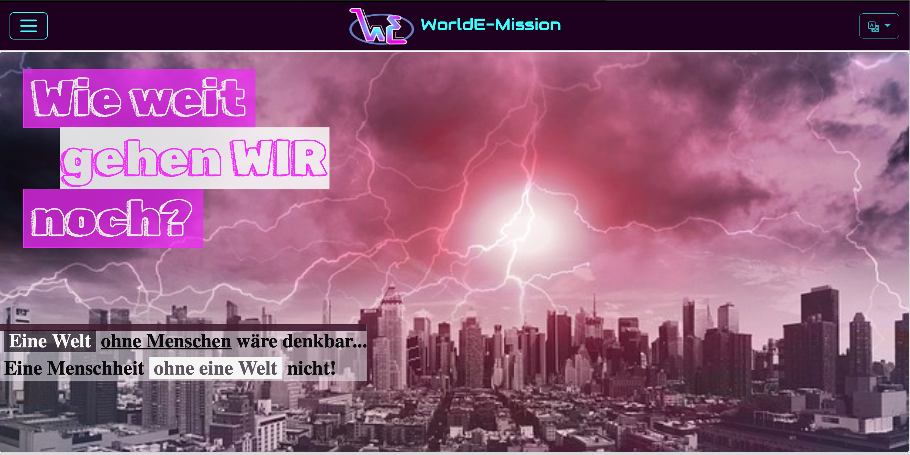
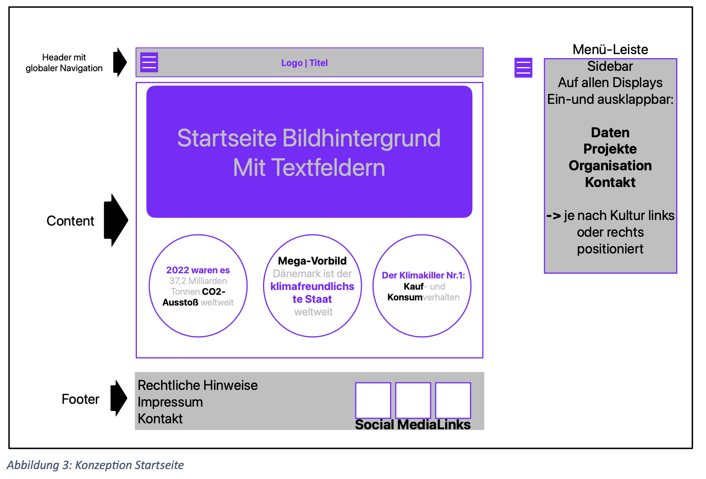
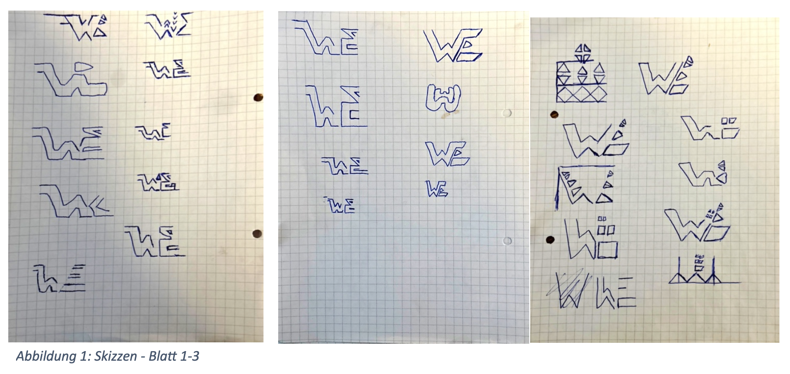
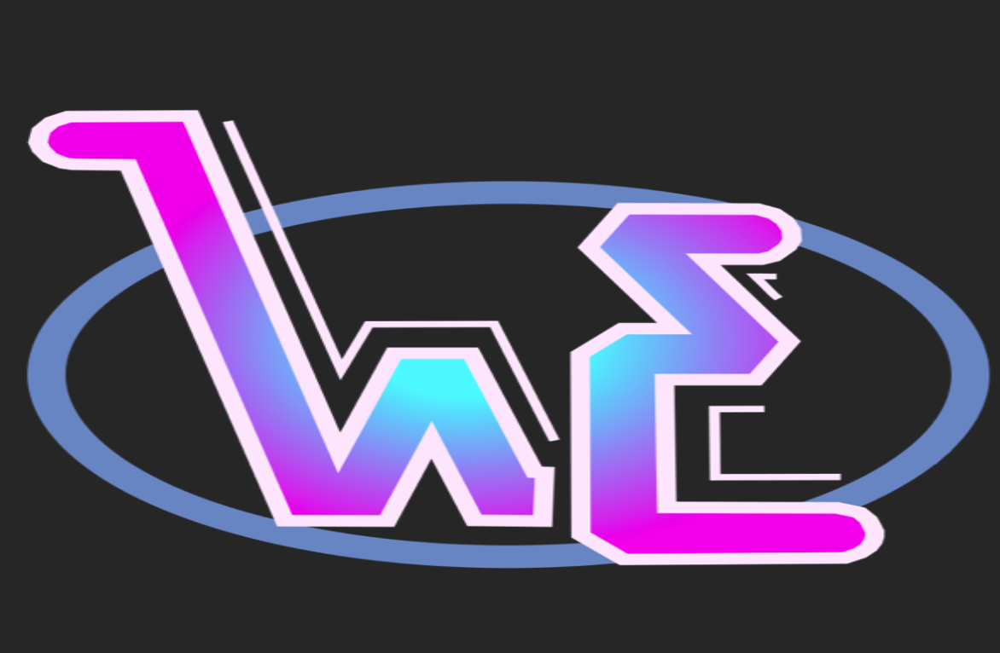

# Mein erstes Projekt: worldE-Mission  
> Ein kleines Web-Projekt um Grundlagen der Webentwicklung zu erlernen. Ziel war die Konzeption und Erstellung einer Webseite zur Bewusstseinsbildung über CO₂-Emissionen weltweit.

## 🚀 Projektziel  
Mit „worldE-Mission“ sollte beispielhaft die Datenausgabe und -verarbeitung.

**Kernthemen sind:**
responsives Design,
Datenvisualisierung & Filterung,
Unterstützung der arabischen Sprache (RTL).  

## Hauptmerkmale  
- Voll responsives Frontend – funktioniert auf Desktop, Tablet & Mobil.  
- Eine interaktive Datentabelle, die JSON-Daten lädt, sortiert und filtert.  
- Mehrsprachigkeit inkl. Right-to-Left (RTL) Layout am Beispiel Arabisch.  
- Logo und Konzeptskizze komplett selbst entworfen: Design-Underscore seit Beginn.  
- Umsetzung mit Bootstrap + ein wenig reinem JavaScript (ohne großes Framework) – klar & schlank.  

[mobile Ansicht](img/mobile-ansicht.png)

## 🧰 Technologie-Stack  
- HTML5 + CSS3  
- Bootstrap (Version siehe package.json)  
- JavaScript (für Datenhandling & Filterung)  
- JSON-Datenquelle (z. B. `emissions.json`)  
- Struktur mit zwei Sprachversionen: Englisch/deutsch + Arabisch (RTL)  

## 📁 Projekthauptstruktur  
- `index.html`, `daten.html`, `ar-index.html` … → Hauptseiten für unterschiedliche Sprach-/Layoutvarianten 
- `tableData.js` bzw. `ar-tableData.js` → JS-Logik zur Datenverarbeitung & Filterung 
- `emissions.json`, `ar-emissions.json` → Rohdaten der CO₂-Emissionswerte  
- `main.css`, `kontakt.css`, `ar-main.css` … → Styling inkl. RTL-Variante  
- `img/` → Logo, Konzeptskizzen, Screenshots 
- `package.json`, `package-lock.json` → (falls Bootstrap via npm eingebunden)

### ✅ Was gut ist (Reflexion)

Klarer Fokus auf responsives Design + Dateninteraktion – ideal für schnelle Visualisierung.
RTL-Unterstützung zeigt technisches Interesse über Standard hinaus – gut für Portfolio.
Eigenes Logo + Konzeptskizze zeigen Designgedanken und Vollständigkeit.
🔧 Mögliche Verbesserungen / Next Steps
Datenaktualisierung automatisieren z. B. via API statt statischem JSON.
Erweiterung um Charts (z. B. mit Chart.js) zur Visualisierung von Trends.
Lokalisierung erweitern (weitere Sprachen).
Unit-Tests oder UI-Automatisierung (z. B. mit Cypress) ergänzen.
SEO/Accessibility (WCAG) prüfen und verbessern.

### 👤 Autor
Rusmir Omerovic – Student der Informatik, mit Fokus auf saubere Umsetzung & User-Centric Design